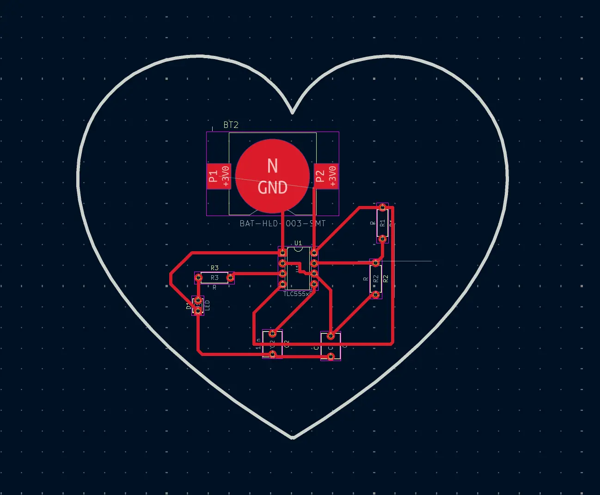

# Lamees Hardware Portfolio

A portfolio website showcasing hardware projects built for the Creative Embedded Systems class. The site is built with Next.js and documents each project with photos, reflections, and design details.

## Projects

### Project 1 — Soldering Sculpture

A wire sculpture of my name ("LAMEES") soldered onto a protoboard. This project focused on learning soldering fundamentals — how to hold the iron, apply solder cleanly, and build a freestanding structure from wire.


**Materials:**
- Protoboard
- Solder wire
- Soldering iron
- Wire cutters

**Process:**
1. Watched soldering tutorials to learn proper technique
2. Practiced applying solder to protoboard pins
3. Shaped wire into letter forms and soldered each letter onto the board
4. Ensured solder joints were clean and didn't overlap adjacent pins

---

### Project 2 — Heart PCB

A custom heart-shaped PCB designed in KiCad and fabricated from scratch. The board drives LEDs using an ATtiny microcontroller, resistors, and a battery holder.




**Materials:**
- Custom PCB (fabricated from KiCad design files)
- ATtiny microcontroller
- LEDs
- Resistors
- Battery holder + battery
- Solder wire & soldering iron

**Design files:** The KiCad schematic and board layout are documented in the project gallery on the website.

**Process:**
1. Designed the circuit schematic in KiCad (LEDs, resistors, ATtiny, battery)
2. Laid out the PCB in a heart shape
3. Sent the design for fabrication
4. Soldered all components onto the finished board
5. Debugged a broken trace where a resistor pulled off part of the copper — fixed by jumpering the connection back to the original port

**Demo video:** [demo.MOV](public/images/projects/project-2/demo.MOV)

---

## Installation & Usage

### Prerequisites

- [Node.js](https://nodejs.org/) v18 or later
- npm (included with Node.js)

### Setup

```bash
# Clone the repository
git clone https://github.com/lamwasil2203/lamees_hardware.git
cd lamees_hardware

# Install dependencies
npm install

# Start the development server
npm run dev
```

The site will be available at `http://localhost:3000`.

### Build for Production

```bash
npm run build
npm start
```

## Tech Stack

- **Framework:** Next.js 16 (App Router)
- **Styling:** Tailwind CSS v4
- **Language:** TypeScript
- **Fonts:** Playfair Display, DM Sans, Courier New

## Project Structure

```
src/
├── app/                    # Next.js pages (home, project detail)
├── components/             # UI components (layout, home, project, ui)
├── data/projects.ts        # All project content (text, image paths, reflections)
├── lib/projects.ts         # Helper functions for querying projects
└── types/project.ts        # TypeScript interfaces
public/
└── images/projects/        # Project images organized by slug
    ├── project-1/          # Soldering sculpture photos
    └── project-2/          # Heart PCB photos + demo video
```

### Adding a New Project

1. Add a new project object to `src/data/projects.ts` following the existing format
2. Drop images into `public/images/projects/<slug>/`
3. The site automatically generates the project page via the dynamic route at `src/app/projects/[slug]/page.tsx`
